<div align="center">

# Machine Learning for Pharmacy Inventory Management

### Stock Status Classification and Recommended Order Quantity Prediction

<p>
  
  
  
  
  
</p>

<p>
  A machine learning framework for simulated pharmacy inventory decision support<br/>
  combining <strong>classification</strong> and <strong>regression</strong> on synthetic data.
</p>

<p>
  <a href="#overview">Overview</a> &bull;
  <a href="#workflow">Workflow</a> &bull;
  <a href="#dataset-summary">Dataset</a> &bull;
  <a href="#classification-results">Classification</a> &bull;
  <a href="#regression-results">Regression</a> &bull;
  <a href="#key-findings">Findings</a>
</p>

</div>

---

## Overview

This project presents a machine learning framework for **pharmacy inventory management** using **synthetic data**. It combines two complementary tasks:

- **Classification** — identifies stock status as `understock`, `balanced`, or `overstock`
- **Regression** — predicts the **recommended order quantity** for the next day

The study simulates pharmacy inventory behavior across products, demand, lead time, and shelf life, then applies machine learning to support inventory decision-making.

---

## Project Objectives

- Simulate realistic pharmacy inventory behavior using synthetic data
- Engineer inventory-related features from raw stock movement data
- Classify stock status into `understock`, `balanced`, or `overstock`
- Predict recommended order quantity for replenishment
- Analyze feature importance and model behavior through charts and tables

---

## Repository Structure

```bash
.
├── saved_model/
│   ├── risk_class_random_forest.pkl
│   └── order_quantity_regressor.pkl
├── dataset/
│   ├── pharmacy_inventory_daily_raw_30_products_600_days.csv
│   └── pharmacy_inventory_feature_engineered.csv
├── output/
│   ├── classification_outputs.csv
│   ├── regression_outputs.csv
│   └── latest_snapshot_predictions.csv
├── images/
├── Pharmacy_Inventory_Classification_and_Regression.ipynb
└── README.md
```

---

## Tools and Libraries

<p>
  
  
  
  
  
</p>

---

## Architecture
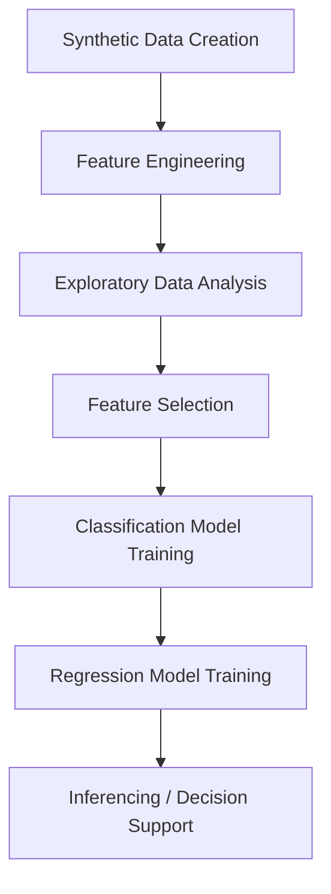

---

## Dataset Summary

The engineered dataset contains:

| Item | Value |
|---|---|
| Number of rows | 18,000 |
| Number of products | 30 |
| Number of days | 600 |
| Number of columns | 14 |
| `sold_qty` range | 0 – 96 |
| `ending_stock` range | 0 – 477 |
| `avg_sales_7d` range | 1.00 – 70.29 |
| `days_to_sell_inventory` range | 0.00 – 75.00 |

---

## Feature Engineering

The following key features were derived from the raw synthetic inventory data:

- `ending_stock`
- `avg_sales_7d`
- `required_stock`
- `avg_remaining_shelf_life_days`
- `days_to_sell_inventory`

### Ground Truth Logic

**Classification target:** `risk_class`

| Condition | Label |
|---|---|
| `ending_stock < required_stock` | `understock` |
| `ending_stock > 1.8 × required_stock` | `overstock` |
| `days_to_sell_inventory > 0.2 × avg_remaining_shelf_life_days` | `overstock` |
| Otherwise | `balanced` |

**Regression target:** `recommended_order_qty_next_day`

---

## Exploratory Data Analysis

### Distribution of Sales and Ending Stock

<p align="center">
  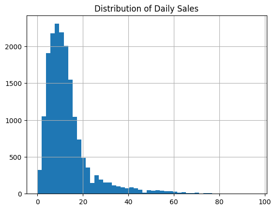
  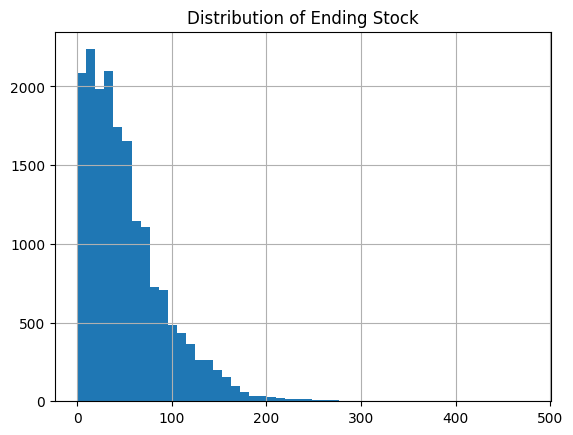
  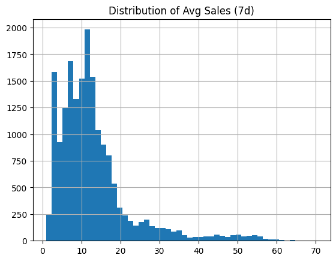
</p>

Most observations are concentrated in the lower to moderate value ranges, while higher values occur less frequently.

### Monthly Seasonality

<p align="center">
  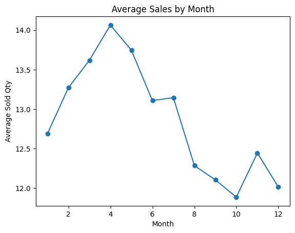
</p>

The monthly sales trend suggests that the synthetic dataset simulates real-world seasonality, with demand varying across months rather than remaining constant over time.

### Feature Correlation Matrix

<p align="center">
  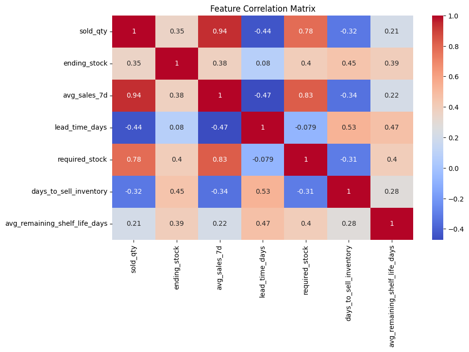
</p>

The strongest correlation was observed between `sold_qty` and `avg_sales_7d` (**r = 0.94**), followed by `avg_sales_7d` and `required_stock` (**r = 0.83**), and `sold_qty` and `required_stock` (**r = 0.78**).

---

## Classification Results

The rule-based target generation produced three classes:

| Class | Count | Percentage |
|---|---|---|
| `understock` | 8,539 | 47.44% |
| `balanced` | 5,583 | 31.02% |
| `overstock` | 3,878 | 21.54% |

The Random Forest classifier achieved near-perfect performance on the test set.

### Performance Metrics

| Class | Precision | Recall | F1-score | Support |
|---|---|---|---|---|
| `balanced` | 0.99 | 1.00 | 1.00 | 1,117 |
| `overstock` | 1.00 | 1.00 | 1.00 | 775 |
| `understock` | 1.00 | 1.00 | 1.00 | 1,708 |
| **Accuracy** | | | **1.00** | **3,600** |

### Confusion Matrix

<p align="center">
  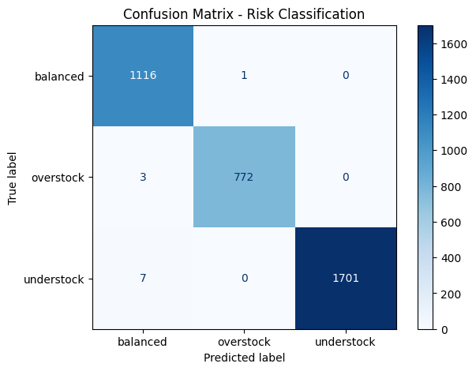
</p>

The confusion matrix shows very few misclassifications, indicating strong separation between inventory states.

### Feature Importance

| Feature | Importance |
|---|---|
| `days_to_sell_inventory` | 0.4514 |
| `ending_stock` | 0.1808 |
| `lead_time_days` | 0.1363 |
| `required_stock` | 0.1117 |
| `avg_sales_7d` | 0.0813 |
| `avg_remaining_shelf_life_days` | 0.0384 |

<p align="center">
  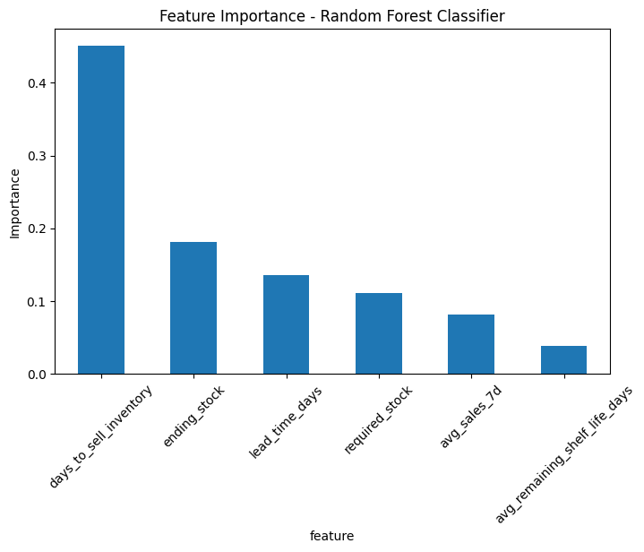
</p>

The most influential feature for classification was `days_to_sell_inventory`, highlighting stock coverage as the strongest signal in determining stock status.

---

## Regression Results

The regression target `recommended_order_qty_next_day` had the following distribution:

| Statistic | Value |
|---|---|
| Mean | 20.37 |
| Median | 8.44 |
| Minimum | 0.00 |
| Maximum | 191.58 |

### Performance Metrics

| Metric | Value |
|---|---|
| MAE | 0.4840 |
| RMSE | 1.1023 |
| R² Score | **0.9984** |

These results indicate that the model predicted recommended order quantities with very small error.

### Actual vs. Predicted and Residual Plot

<p align="center">
  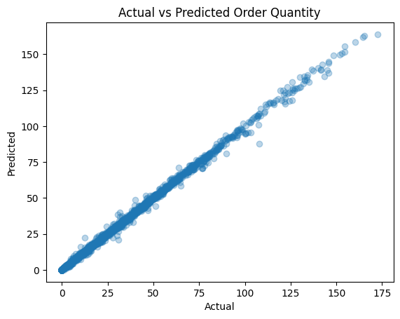
  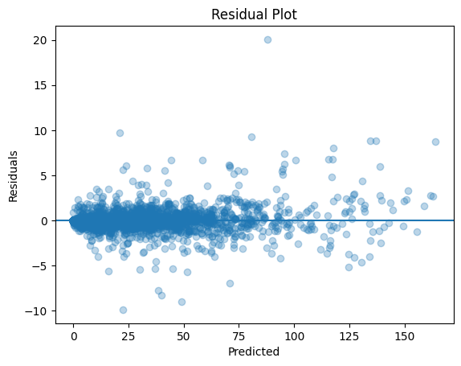
</p>

The predicted values closely align with the actual values, while residuals remain centered near zero.

### Feature Importance

| Feature | Importance |
|---|---|
| `days_to_sell_inventory` | 0.6607 |
| `required_stock` | 0.2792 |
| `lead_time_days` | 0.0342 |
| `avg_sales_7d` | 0.0229 |
| `ending_stock` | 0.0019 |
| `avg_remaining_shelf_life_days` | 0.0012 |

<p align="center">
  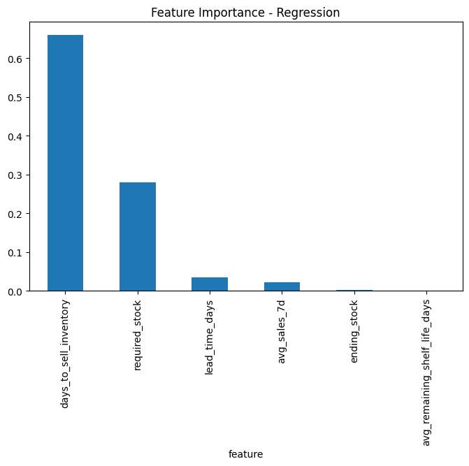
</p>

As in classification, `days_to_sell_inventory` was the dominant predictor, suggesting that replenishment decisions were primarily driven by stock coverage relative to expected demand.

---

## Key Findings

- The classification model accurately identified `understock`, `balanced`, and `overstock` conditions
- The regression model predicted recommended order quantity with very low error (R² = 0.9984)
- `days_to_sell_inventory` consistently emerged as the most important feature in both tasks
- The synthetic dataset captured meaningful variation in inventory behavior, including seasonality and stock-demand dynamics

---

## Conclusion

This project demonstrates that machine learning can support pharmacy inventory decision-making by combining stock status classification and recommended order quantity prediction. Using engineered inventory features, the framework translates pharmacy inventory logic into a scalable predictive system for simulated decision support.

---

## Future Improvements

- Test the framework on real pharmacy inventory data
- Include supplier disruptions and stock substitution behavior
- Add batch-level expiry tracking
- Compare model recommendations with real pharmacist decisions
- Deploy the workflow as a simple dashboard or web application

---

<div align="center">
  <sub>Built with Python and scikit-learn &bull; Synthetic data generated for research purposes</sub>
</div>