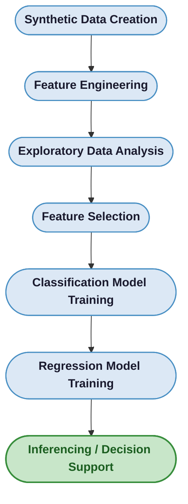

<div align="center">
 
# Machine Learning for Pharmacy Inventory Management
 
### Stock Status Classification and Recommended Order Quantity Prediction
 
<p>
  
  
  
  
  
</p>
 
<p>
  A machine learning framework for simulated pharmacy inventory decision support<br/>
  combining <strong>classification</strong> and <strong>regression</strong> on synthetic data.
</p>
 
<p>
  <a href="#overview">Overview</a> &nbsp;|&nbsp;
  <a href="#workflow">Workflow</a> &nbsp;|&nbsp;
  <a href="#dataset-summary">Dataset</a> &nbsp;|&nbsp;
  <a href="#classification-results">Classification</a> &nbsp;|&nbsp;
  <a href="#regression-results">Regression</a> &nbsp;|&nbsp;
  <a href="#key-findings">Findings</a>
</p>
 
<table>
  <tr>
    <td><strong>Author</strong></td>
    <td>Kyla Mae N. Valoria</td>
    <td>
      <a href="https://drive.google.com/file/d/1LPu3pg6arXND0Mgm4SjKTA7hPSxKPAcx/view?usp=sharing">
        
      </a>
    </td>
  </tr>
</table>
 
</div>
 
<br/>
 
## Overview
 
This project presents a machine learning framework for **pharmacy inventory management** using **synthetic data**. It combines two complementary predictive tasks:
 
| Task | Description | Target |
|:---:|---|:---:|
| **Classification** | Identifies current stock status | `understock` / `balanced` / `overstock` |
| **Regression** | Predicts replenishment quantity | `recommended_order_qty_next_day` |
 
The study simulates pharmacy inventory behavior across products, demand, lead time, and shelf life — then applies machine learning to support inventory decision-making.
 
> [!NOTE]
> All data used in this project is **synthetically generated**. Results are intended for research and simulation purposes only.
 
<br/>
 
## Project Objectives
 
- [ ] Simulate realistic pharmacy inventory behavior using synthetic data
- [ ] Engineer inventory-related features from raw stock movement data
- [ ] Classify stock status into `understock`, `balanced`, or `overstock`
- [ ] Predict recommended order quantity for replenishment
- [ ] Analyze feature importance and model behavior through charts and tables
 
<br/>
 
## Repository Structure
 
<details>
<summary><strong>Click to expand file tree</strong></summary>
 
```bash
.
├── saved_model/
│   ├── risk_class_random_forest.pkl
│   └── order_quantity_regressor.pkl
├── dataset/
│   ├── pharmacy_inventory_daily_raw_30_products_600_days.csv
│   └── pharmacy_inventory_feature_engineered.csv
├── output/
│   ├── classification_outputs.csv
│   ├── regression_outputs.csv
│   └── latest_snapshot_predictions.csv
├── images/
├── Pharmacy_Inventory_Classification_and_Regression.ipynb
└── README.md
```
 
</details>
 
<br/>
 
## Tools and Libraries
 
<p>
  
  
  
  
  
</p>
 
<br/>
 
## Workflow
 

 
<br/>
 
## Dataset Summary
 
> [!TIP]
> The engineered dataset spans **600 days** across **30 products**, yielding 18,000 rows of simulated inventory behavior.
 
| Item | Value |
|:---|:---:|
| Number of rows | `18,000` |
| Number of products | `30` |
| Number of days | `600` |
| Number of columns | `14` |
| <kbd>sold_qty</kbd> range | 0 – 96 |
| <kbd>ending_stock</kbd> range | 0 – 477 |
| <kbd>avg_sales_7d</kbd> range | 1.00 – 70.29 |
| <kbd>days_to_sell_inventory</kbd> range | 0.00 – 75.00 |
 
<br/>
 
## Feature Engineering
 
The following features were derived from the raw synthetic inventory data:
 
<kbd>ending_stock</kbd> &nbsp; <kbd>avg_sales_7d</kbd> &nbsp; <kbd>required_stock</kbd> &nbsp; <kbd>avg_remaining_shelf_life_days</kbd> &nbsp; <kbd>days_to_sell_inventory</kbd>
 
<br/>
 
### Ground Truth Logic
 
**Classification target:** <kbd>risk_class</kbd>
 
| Condition | Assigned Label |
|---|:---:|
| `ending_stock` < `required_stock` | `understock` |
| `ending_stock` > 1.8 × `required_stock` | `overstock` |
| `days_to_sell_inventory` > 0.2 × `avg_remaining_shelf_life_days` | `overstock` |
| Otherwise | `balanced` |
 
**Regression target:** <kbd>recommended_order_qty_next_day</kbd>
 
<br/>
 
## Exploratory Data Analysis
 
### Distribution of Sales and Ending Stock
 
<p align="center">
  
  
  
</p>
 
> Most observations are concentrated in the lower to moderate value ranges, while higher values occur less frequently.
 
### Monthly Seasonality
 
<p align="center">
  
</p>
 
> The monthly sales trend suggests that the synthetic dataset simulates real-world seasonality, with demand varying across months rather than remaining constant over time.
 
### Feature Correlation Matrix
 
<p align="center">
  
</p>
 
The strongest correlations observed:
 
| Pair | Correlation |
|---|:---:|
| <kbd>sold_qty</kbd> vs <kbd>avg_sales_7d</kbd> | **r = 0.94** |
| <kbd>avg_sales_7d</kbd> vs <kbd>required_stock</kbd> | **r = 0.83** |
| <kbd>sold_qty</kbd> vs <kbd>required_stock</kbd> | **r = 0.78** |
 
<br/>
 
## Classification Results
 
### Class Distribution
 
| Class | Count | Share |
|:---:|:---:|:---:|
| `understock` | 8,539 | 47.44% |
| `balanced` | 5,583 | 31.02% |
| `overstock` | 3,878 | 21.54% |
 
> [!IMPORTANT]
> The Random Forest classifier achieved **near-perfect performance** on the held-out test set of 3,600 samples.
 
### Performance Metrics
 
| Class | Precision | Recall | F1-score | Support |
|:---:|:---:|:---:|:---:|:---:|
| `balanced` | 0.99 | 1.00 | 1.00 | 1,117 |
| `overstock` | 1.00 | 1.00 | 1.00 | 775 |
| `understock` | 1.00 | 1.00 | 1.00 | 1,708 |
| **Overall Accuracy** | — | — | **1.00** | **3,600** |
 
### Confusion Matrix
 
<p align="center">
  
</p>
 
> The confusion matrix shows very few misclassifications, indicating strong separation between inventory states.
 
### Feature Importance
 
| Rank | Feature | Importance |
|:---:|---|:---:|
| 1 | <kbd>days_to_sell_inventory</kbd> | 0.4514 |
| 2 | <kbd>ending_stock</kbd> | 0.1808 |
| 3 | <kbd>lead_time_days</kbd> | 0.1363 |
| 4 | <kbd>required_stock</kbd> | 0.1117 |
| 5 | <kbd>avg_sales_7d</kbd> | 0.0813 |
| 6 | <kbd>avg_remaining_shelf_life_days</kbd> | 0.0384 |
 
<p align="center">
  
</p>
 
> [!TIP]
> **`days_to_sell_inventory`** was the most influential feature, highlighting stock coverage as the strongest signal for determining inventory state.
 
<br/>
 
## Regression Results
 
### Target Distribution — <kbd>recommended_order_qty_next_day</kbd>
 
<table align="center">
  <tr>
    <th>Mean</th>
    <th>Median</th>
    <th>Minimum</th>
    <th>Maximum</th>
  </tr>
  <tr>
    <td align="center">20.37</td>
    <td align="center">8.44</td>
    <td align="center">0.00</td>
    <td align="center">191.58</td>
  </tr>
</table>
 
<br/>
 
### Performance Metrics
 
<table align="center">
  <tr>
    <th>MAE</th>
    <th>RMSE</th>
    <th>R² Score</th>
  </tr>
  <tr>
    <td align="center">0.4840</td>
    <td align="center">1.1023</td>
    <td align="center"><strong>0.9984</strong></td>
  </tr>
</table>
 
> [!IMPORTANT]
> An **R² of 0.9984** indicates the model explains 99.84% of variance in recommended order quantities — with minimal prediction error.
 
### Actual vs. Predicted and Residual Plot
 
<p align="center">
  
  
</p>
 
> Predicted values closely align with actuals, while residuals remain centered near zero — confirming a well-calibrated model.
 
### Feature Importance
 
| Rank | Feature | Importance |
|:---:|---|:---:|
| 1 | <kbd>days_to_sell_inventory</kbd> | 0.6607 |
| 2 | <kbd>required_stock</kbd> | 0.2792 |
| 3 | <kbd>lead_time_days</kbd> | 0.0342 |
| 4 | <kbd>avg_sales_7d</kbd> | 0.0229 |
| 5 | <kbd>ending_stock</kbd> | 0.0019 |
| 6 | <kbd>avg_remaining_shelf_life_days</kbd> | 0.0012 |
 
<p align="center">
  
</p>
 
<br/>
 
## Key Findings
 
> [!NOTE]
> The following summarizes the core outcomes of this study.
 
- The classification model accurately identified `understock`, `balanced`, and `overstock` conditions across all test samples
- The regression model predicted recommended order quantity with very low error **(R² = 0.9984)**
- <kbd>days_to_sell_inventory</kbd> consistently emerged as the dominant feature in **both** tasks
- The synthetic dataset captured meaningful inventory variation including seasonality and stock-demand dynamics
 
<br/>
 
## Conclusion
 
> This project demonstrates that machine learning can support pharmacy inventory decision-making by combining **stock status classification** and **recommended order quantity prediction**. Using engineered inventory features, the framework translates pharmacy inventory logic into a scalable predictive system for simulated decision support.
 
<br/>
 
## Future Improvements
 
<details>
<summary><strong>Click to expand</strong></summary>
 
- [ ] Test the framework on real pharmacy inventory data
- [ ] Include supplier disruptions and stock substitution behavior
- [ ] Add batch-level expiry tracking
- [ ] Compare model recommendations with real pharmacist decisions
- [ ] Deploy the workflow as a simple dashboard or web application
 
</details>
 
<br/>
 
---
 
<div align="center">
  <sub>
    Built with Python and scikit-learn &nbsp;&bull;&nbsp; Synthetic data generated for research purposes<br/>
    <a href="https://drive.google.com/file/d/1LPu3pg6arXND0Mgm4SjKTA7hPSxKPAcx/view?usp=sharing">Read the Technical Paper</a>
  </sub>
</div>
